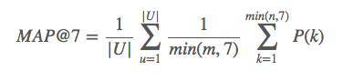

# Machine Learning Engineer Nanodegree
# Capstone Proposal

Lucas Oliveira Souza, December 16th, 2016

## Proposal

The project is a newly added Kaggle competition, Santander Product Recommendation. I've been applying ML at projects at work and in the academia, but that is my first experience on Kaggle (apart from the Titanic project).

Competition details available at: https://www.kaggle.com/c/santander-product-recommendation

### Domain Background

The project is a product recommendation for Santander. The product here are bank products, such as loans, investments, and other financial offers. 

It is important for the bank, or any service provider, to understand which products are the customers most likely to acquire in order to better target its marketing efforts and properly predict service/product comsumption in short and medium term. Banks usually have a baseline of predictions for each product, but machine learning could help in customizing its predictions per customer. 

My personal motivation to tackling this problem is joining a Kaggle competition, interacting with fellow machine learning practicioners, and writing public available ML code with Kernels. I have a degree on business and accounting, so I have previous domain knowledge on banking. My current research is on optimized assets allocation of a investment portfolio, a different subject, but within the same industry (banking).

### Problem Statement

The bank wants to know which products its customers are most likely to acquire next based on its past consumption and history with the bank. The output of the model is a list of which products each customers will acquire in the following month. There can be none or any number of existing products for each customer.

### Datasets and Inputs

The dataset has 18 months of customer data of Santander. The dataset is informed to be not representative of Santander customer base, but upon first analysis it looks like anonymized real data (specially since the column headers are in spanish, as the variable names resemble column names of databases).

There are a total of 24 features, ranging from personal information such as gender, age, place of residence, and other customer information such as when was the customer enrolled. On the label side, there are 24 products which a customer can aquire. Four of them are acquired more often, and have a balanced bought/not bought ratio, while the remaining 20 are rarely acquired. 

Data available at: https://www.kaggle.com/c/santander-product-recommendation/data

### Solution Statement

There are several approaches we can take for this problem. The most obvious approach is a recommender system: look for similar customers, let's say X and Y, and predict the customer X will buy similar products to customer Y.

Another approach, with unsupervised learning, is to cluster the customer into groups using clustering algorithm such as k-means or gaussian mixture models, and evaluate which products are most likely to be acquired by each cluster. If a customer in a cluster has not yet acquired one of these products, we can predict he is most likely to buy it.

A third approach, of supervised learning, is to correlate variables to a product acquired, and predict for each customer the likelihood of he/she buying or not each product (likelihood could be a binary label as well: yes, will buy/no, won't buy ). That can be done since we have information of which products were acquired in the past by a particular customer. 

### Benchmark Model

As a reality check, we can apply a sample benchmark by predicting each customer will acquire all 4 most popular products, in order of popularity, if they haven't yet acquired it. That will be a baseline, and serve as reference to measure how our model evolves compared to a simple heuristic.

A second higher level benchmark is Kaggle leaderboard, in which the solutions are evaluated upon test data not made available to the competitors. In the leaderboard we can benchmark our results against solutions from other competitors. 

### Evaluation Metrics

The evaluation metric is already defined by the competition to be the Mean Average Precision @ 7 (MAP@7).

Mean average precision is the average of the average precision for each customer. The average precision is given by the ratio of number of recommended nodes followed, up to the position k, over the number k - in this project, k is defined to be 7.

In layman terms, the evaluation score takes into consideration the precision of each recommendation, considering up to 7 recommendations per customer. Order matters - if you recommend A and B, and customer follow B and A, the score will be lower. The precision is averaged over total recommendations - if you get the first product right, but predict 6 more which the customer doesn't acquire, the precision will be 1/7 instead of 1. 

An optimal solution, therefore, will predict the right products, in the right order, without predicting any extra products the customer will not acquire.  

References:

* https://www.kaggle.com/c/santander-product-recommendation/details/evaluation
* https://www.kaggle.com/wiki/MeanAveragePrecision

### Project Design

Intended workflow:

1. Data Analysis: understand the dataset
2. Features Transformation: convert variables into features. Standardize/normalize features, apply numerical transformations, perform one-hot encoding, etc.
3. Features Creation: analyse the possibility of deriving new features from the existing ones
4. Features Selection or Extraction: select relevant features, or extract main features by extracting principal components
5. Machine Learning Models: apply different strategies, including clustering, recommendation system and classification algorithms. For each strategy, optimize with the best choice of algorithm and parameters (try different algorithms, optimize parameters with grid search + cross validation).
6. Evaluation: evaluate the performance of each strategy, and check possibilities of combining them to extract the best of each one and achieving an optimal model.
7. Submit Results